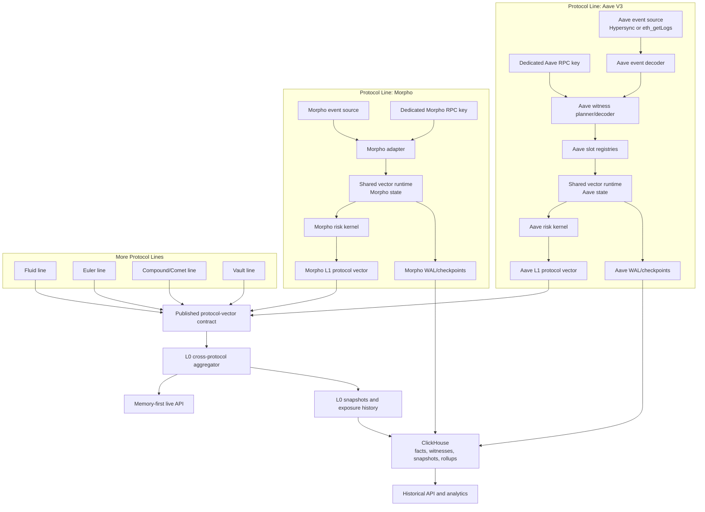

# Unified Architecture

This document defines the final architecture shape. The Aave V3 Rust indexer is
the concrete prototype of a protocol line. The layered vector architecture is the
platform model around many isolated protocol lines.

## One-Sentence Model

Run one isolated vector indexer per protocol, keep live risk in memory, checkpoint
compact vectors durably, and aggregate published protocol vectors into an L0
cross-protocol view.

## Full System Map



## Layer Map

```text
L0 cross_protocol_vector
  Global aggregate across protocol lines.
  Reads published L1 vectors only.

L1 protocol_vector
  One vector per isolated protocol line.
  Includes risk totals, buckets, top risky accounts, exposure summaries, hashes.

L2 asset_reserve_vector
  Asset/reserve state: prices, indexes, decimals, thresholds, caps, liquidity.

L3 market_vector
  Protocol-specific market/product/vault/pair state.
  For Aave, reserve and market are nearly identical.
  For Morpho/Fluid/Euler/vaults, L3 is first-class.

L4 account_position_vector
  Canonical non-accruing account units and flags.

L4 account_risk_vector
  Derived current risk values computed from L2/L3/L4 position vectors.
```

## Isolation Model

Each protocol line owns:

```text
process or container
event source credentials
dedicated RPC API key
RPC rate limits and retry policy
WAL directory
ClickHouse database or namespace
pipeline watermark
indexer run records
vector checkpoints
recovery loop
direct validation command
```

Shared libraries provide:

```text
slot registry primitives
vector storage layouts
dirty account planner
parallel recompute scheduler
checkpoint encoder/decoder
manifest hashing
WAL helper
ClickHouse writer helper
API publication DTOs
common risk math helpers where valid
```

Shared live mutable protocol state is forbidden. Aave RPC degradation must not
block Morpho, Fluid, Euler, or any other protocol line.

## Data Flow

Per confirmed block or block range:

```text
1. Protocol line reads confirmed head.
2. Protocol line reads its own watermark.
3. It chooses the next safe block or block range.
4. It fetches event logs through its own event source.
5. It decodes touched accounts, markets, reserves, assets, and positions.
6. It plans same-block witnesses through its own RPC key.
7. Required witnesses are fetched and decoded.
8. The adapter emits normalized vector mutations.
9. Slot registries assign deterministic account, asset, market, and position ids.
10. Shared vector runtime applies raw state mutations.
11. Dirty planner determines accounts affected by touched account operations,
    price updates, index changes, market-state changes, and risk-param changes.
12. Protocol risk kernel recomputes account risk.
13. L1 protocol vector is updated and published.
14. Durable facts, witnesses, WAL records, checkpoints, manifests, and rollups are
    written asynchronously with a watermark commit gate.
15. L0 consumes the newest valid L1 vectors and updates cross-protocol state.
16. Live APIs read memory vectors.
```

## Canonical Unit Rule

Every protocol stores account truth in non-accruing canonical units:

| Protocol Type | Canonical Account Unit | Derived Exposure Inputs |
| --- | --- | --- |
| Aave / Spark | scaled aToken and scaled debt balances | liquidity index, borrow index, oracle price |
| Morpho | supply shares, borrow shares, collateral balance | total assets, total shares, oracle price |
| Fluid | user shares, vault debt/collateral units | vault state, exchange rate, oracle price |
| Euler | account vault balances and liabilities | vault config, oracle price, liquidation params |
| Compound III | principal/base and collateral balance | base indexes, collateral prices, market config |
| Vaults | user shares | vault total assets, total supply, asset price |

Derived balances are not canonical account truth unless the protocol itself stores
that derived unit on-chain.

## Serving Rule

```text
current/live account risk:
  memory vectors

current/live protocol risk:
  L1 protocol vectors in memory

current/live cross-protocol risk:
  L0 vector in memory

history, audit, recovery, analytics:
  ClickHouse facts, witnesses, snapshots, manifests, rollups

compatibility/debug:
  current rows and argMax latest-state views
```

## Safety Rule

A block range is not canonical until all required pieces agree:

```text
event facts written
required witnesses written
vector mutations applied
risk recompute completed
WAL block/range commit written
snapshot or checkpoint policy satisfied
run record written
watermark advanced
```

If required witnesses fail, the protocol line does not advance its watermark.

## Convergence With Current Aave Runtime

The Aave V3 Rust indexer already implements most L1 protocol-line mechanics:

```text
confirmed block ranges
Hypersync or eth_getLogs event discovery
same-block Multicall3 witnesses
in-memory RiskEngine
exposure indexes
parallel dirty recompute
WAL and watermark gate
async ClickHouse writer
account_risk_vector_snapshots
rollups
direct RPC check command
```

The platform work needed around it is:

```text
durable slot registry snapshots
generalized vector runtime interfaces
published L1 protocol-vector contract
L0 cross-protocol aggregator
memory-first API publication layer
protocol adapter packaging
expanded checkpoint manifests
consistent storage naming across protocol lines
```

## Hard Boundaries

Do not:

```text
run all protocol adapters inside one shared ingestion loop
share one RPC key across protocols
make L0 fetch protocol witnesses
make ClickHouse the live risk calculator
rewrite every account-risk row on every index-only block
store accrued balances as canonical account truth without provenance
advance watermarks after required witness failures
use ClickHouse FINAL on hot serving paths
```

Do:

```text
isolate protocol lines
use same-block witnesses
store raw facts and witnesses durably
keep canonical units in vectors
derive live risk in memory
publish L1 vectors
aggregate at L0 from L1 outputs
checkpoint compact vectors
validate with direct RPC samples
```
