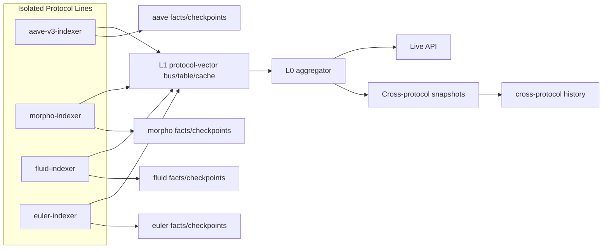

# Platform Architecture

The platform is the multi-protocol system around isolated protocol lines. It does
not replace protocol-line runtimes; it coordinates their outputs, exposes shared
contracts, and serves cross-protocol risk.

## Responsibilities

The platform owns:

```text
protocol-line deployment conventions
shared vector runtime libraries
published L1 protocol-vector contract
L0 cross-protocol aggregation
memory-first live API router
cross-protocol exposure normalization
global operational dashboards
global snapshot manifests where needed
shared benchmark and validation harnesses
```

The platform does not own:

```text
protocol RPC keys
protocol event watermarks
protocol WAL mutation order
protocol witness success/failure decisions
protocol risk kernel internals
protocol adapter state
```

Those belong to each isolated protocol line.

## Platform Topology



The L1 publication medium can initially be process memory plus an internal API,
then evolve to a local shared cache, ClickHouse latest table, or durable message
stream. The contract is more important than the transport.

## L1 Publication Contract

Each protocol line publishes a protocol vector:

```text
protocol_id
deployment_id
chain_id
block_number
block_hash
block_timestamp
watermark
vector_epoch_id
producer_version
schema_version
account_count
market_count
asset_count
total_collateral_usd
total_debt_usd
total_liquidation_value_usd
risky_accounts
health_factor_buckets
top_risky_accounts
asset_exposure_summary
market_exposure_summary
protocol_vector_hash
dependency_hashes
status
```

Requirements:

```text
The vector is immutable for its epoch.
The vector is only published after protocol-line watermark commit.
The vector includes enough hashes for L0 to detect stale dependencies.
The vector does not expose protocol-internal mutable pointers.
The vector uses normalized addresses and canonical deployment identifiers.
```

## L0 Cross-Protocol Aggregator

L0 consumes L1 vectors and computes:

```text
global total collateral
global total debt
global total liquidation value
global risky account counts
protocol ranking by debt/collateral/risk
asset-correlated exposures
top risky accounts across protocols
cross-protocol borrower views where identity is known
global health-factor buckets
cross_protocol_vector_hash
```

L0 does not:

```text
call chain RPC
fetch protocol witnesses
decode protocol events
mutate protocol vectors
decide protocol watermarks
repair protocol state
```

If a protocol line is stale, L0 marks it stale and continues aggregating the other
lines. Aave being late must not make the global API unavailable for Morpho or
Fluid.

## Cross-Protocol Time Alignment

Different protocols may publish at slightly different blocks. L0 should support
two modes:

```text
latest_valid:
  Use each protocol's newest valid L1 vector.
  Best for live dashboards.

block_aligned:
  Use protocol vectors at or before a requested block/time.
  Best for historical comparisons and audits.
```

The live default is `latest_valid`. Historical APIs can request block-aligned or
time-bucketed views from ClickHouse snapshots and rollups.

## Shared Libraries

The platform should provide libraries for:

```text
SlotRegistry
VectorStore
DirtyPlanner
RiskScheduler
CheckpointCodec
SnapshotManifest
WalSegment
ClickHouseWriter
ProtocolVectorPublisher
L0Aggregator
ValidationHarness
BenchmarkHarness
```

These libraries are reusable, but each protocol line instantiates its own state.

## Deployment Rules

Recommended production deployment:

```text
one container/process per protocol line
one container/process for L0 aggregator
one live API process that reads memory state from protocol lines and L0
one ClickHouse cluster/instance for durable facts and history
one observability surface for all lines
```

Minimum isolation per protocol line:

```text
RPC_API_KEY_<PROTOCOL>
HYPERSYNC_API_KEY_<PROTOCOL> or equivalent
WAL_DIR_<PROTOCOL>
CLICKHOUSE_DATABASE_<PROTOCOL>
PIPELINE_WATERMARK_<PROTOCOL>
INDEXER_RUNS_<PROTOCOL>
RATE_LIMIT_CONFIG_<PROTOCOL>
```

Optional but recommended:

```text
separate RPC provider per critical protocol
separate ClickHouse database per protocol
per-protocol resource limits
per-protocol alerting thresholds
per-protocol replay controls
```

## Failure Domains

| Failure | Expected Platform Behavior |
| --- | --- |
| One protocol RPC key rate-limited | Only that protocol line slows or stops watermark advancement |
| Hypersync unavailable for one protocol | That line falls back to RPC logs if configured |
| Required witness failure | That line does not commit the block/range |
| ClickHouse write latency spike | That line applies backpressure or pauses commit |
| L0 process restart | L0 reloads latest published L1 vectors and resumes |
| API process restart | API reconnects to memory publishers and ClickHouse fallback |
| Protocol checkpoint hash failure | That protocol rebuilds from facts/witnesses; other lines continue |

## Platform Data Contracts

The platform-level durable tables or streams are:

```text
protocol_vector_latest
protocol_vector_snapshots
cross_protocol_vector_latest
cross_protocol_vector_snapshots
cross_protocol_asset_exposure_snapshots
platform_indexer_runs
platform_alert_events
```

Protocol-owned durable tables are described in
`05_STORAGE_CHECKPOINTS_RECOVERY.md`.

## Platform Observability

Track per protocol:

```text
latest committed block
confirmed head lag
published L1 block
RPC calls per block
RPC failures per block
witness batch latency
dirty account count
risk compute latency
checkpoint encode latency
ClickHouse write latency
WAL lag
watermark status
validation status
```

Track globally:

```text
L0 update latency
stale protocol count
global collateral/debt/risk totals
API memory epoch age
cross-protocol snapshot success
top global exposure changes
```

## Platform Acceptance Criteria

The platform is production-ready when:

```text
each protocol line can restart independently
each protocol line can replay independently
each protocol has a dedicated RPC key and rate limits
L0 continues operating when one protocol is stale
live API can serve current protocol and global risk from memory
ClickHouse can recover history and snapshots
vector hashes validate across checkpoint/replay
direct RPC validation exists for each protocol line
```
