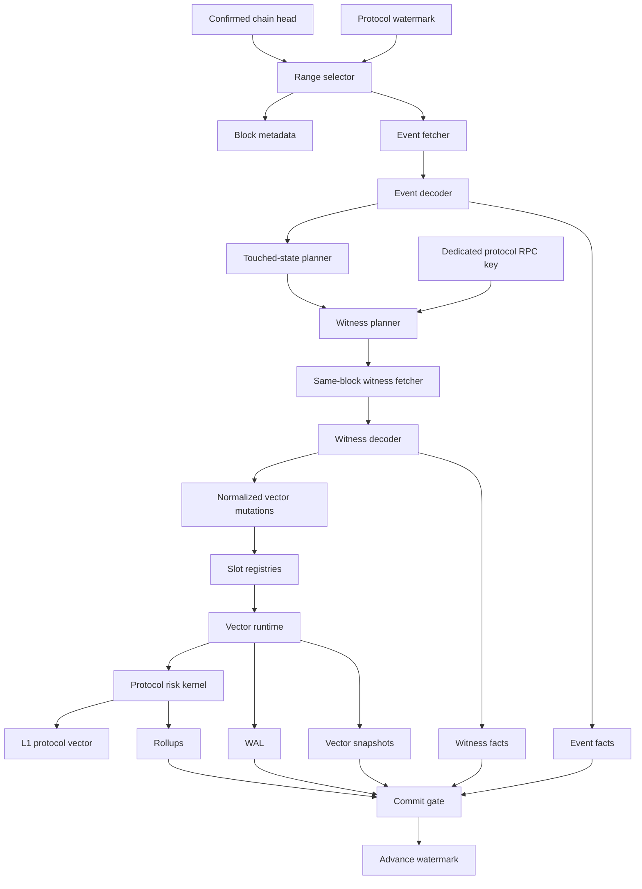

# Protocol Line Blueprint

A protocol line is the reusable runtime unit of the system. It is the generalized
form of the current Aave V3 Rust indexer.

Each protocol line is isolated. It owns its ingestion, RPC key, WAL, watermarks,
vector state, checkpoints, and validation. Shared libraries are linked into the
line, but live mutable state is not shared with other protocols.

## Protocol Line Map



## Runtime Responsibilities

A protocol line must:

```text
load latest valid state on startup
choose safe confirmed block ranges
fetch and decode protocol events
plan deterministic same-block witnesses
fetch required witness state through its own RPC key
decode witnesses into canonical vector updates
mutate in-memory vectors
compute dirty account sets
run protocol risk projection
publish L1 protocol vector
write durable facts, witnesses, checkpoints, and rollups
commit WAL and watermark only after success
expose status and validation commands
recover from snapshots or facts/witnesses
```

## Startup Flow

```text
1. Load ProtocolSpec.
2. Open protocol WAL directory.
3. Connect to protocol ClickHouse namespace.
4. Load latest valid snapshot manifest.
5. Load slot registries.
6. Load L2/L3/L4 vector checkpoints where available.
7. Replay WAL segments after the checkpoint if required.
8. Replay facts/witnesses after the checkpoint if WAL is insufficient.
9. Recompute risk vectors and L1 aggregate.
10. Verify vector hashes.
11. Load protocol watermark.
12. Start live loop.
```

If no valid vector checkpoint exists, the line builds from the latest bootstrap
anchor plus raw facts/witnesses.

## Per-Block Or Range Flow

The Aave implementation currently processes safe confirmed ranges. The reusable
runtime supports either one block at a time or bounded ranges.

```text
1. Read confirmed head.
2. Read current protocol watermark.
3. Select next range:
   from_block = watermark + 1
   to_block = min(confirmed_head, watermark + max_blocks_per_tick)

4. Fetch block metadata for every block in the range.
5. Fetch event logs:
   preferred indexed event source
   RPC eth_getLogs fallback if configured

6. Decode event facts.
7. Build touched-state graph:
   accounts
   assets/reserves
   markets/products/vaults
   account-market pairs
   position identities

8. WAL append range_begin.
9. Write decoded event facts.
10. Plan same-block witnesses for every required touched state.
11. Fetch witnesses with deterministic Multicall batches.
12. Decode witnesses and write witness facts.
13. Apply vector mutations.
14. Recompute dirty account risk.
15. Update protocol aggregate and L1 vector.
16. Write current raw rows if enabled.
17. Write vector checkpoint if checkpoint window is ready.
18. Write rollups if boundary is reached.
19. WAL append block/range commit.
20. Write indexer run metrics.
21. Advance watermark.
```

## Commit Gate

The protocol line must not advance its watermark until:

```text
all required event facts are written
all required witnesses are successful and written
vector mutations are applied
risk recompute has completed
WAL commit record is durable
required snapshot/rollup writes are acknowledged
indexer run record is written
vector hash state is internally consistent
```

Optional/debug witnesses can fail without blocking if the ProtocolSpec marks
them optional. Required witnesses block the watermark.

## ProtocolSpec

`ProtocolSpec` defines static and semi-static protocol configuration:

```rust
trait ProtocolSpec {
    fn protocol_id(&self) -> &'static str;
    fn deployment_id(&self) -> &'static str;
    fn chain_id(&self) -> u64;
    fn contracts(&self) -> ProtocolContracts;
    fn event_topics(&self) -> EventTopicSet;
    fn witness_policy(&self) -> WitnessPolicy;
    fn checkpoint_policy(&self) -> CheckpointPolicy;
    fn risk_kernel_id(&self) -> &'static str;
}
```

Examples:

```text
Aave:
  pool address
  reserve list
  aToken/debt token mapping
  oracle addresses
  e-mode categories
  reserve config fields

Morpho:
  market ids
  oracle addresses
  irm addresses if needed
  collateral/debt token metadata
  share conversion fields

Fluid:
  vault/product ids
  resolver contracts
  vault config fields
  account position witness calls
```

## Adapter Interfaces

Recommended interface split:

```rust
trait EventDecoder {
    fn decode_logs(&self, logs: &[RawLog]) -> DecodedEvents;
}

trait TouchedStatePlanner {
    fn touched_state(&self, events: &DecodedEvents) -> TouchedState;
}

trait WitnessPlanner {
    fn plan_market_witnesses(&self, block: u64, touched: &TouchedState) -> Vec<WitnessCall>;
    fn plan_account_witnesses(&self, block: u64, touched: &TouchedState) -> Vec<WitnessCall>;
}

trait WitnessDecoder {
    fn decode_witnesses(&self, block: u64, results: &[WitnessResult]) -> DecodedWitnesses;
}

trait MutationAdapter {
    fn mutations(&self, events: &DecodedEvents, witnesses: &DecodedWitnesses) -> Vec<VectorMutation>;
}

trait RiskKernel {
    fn project_account(&self, account_idx: AccountIndex, vectors: &VectorReadView) -> AccountRisk;
}
```

The adapter should not own the vector storage implementation. It emits normalized
mutations and supplies protocol-specific risk math.

## Normalized Mutations

The vector runtime should understand a small set of normalized mutations:

```text
upsert_asset
upsert_market
upsert_position
delete_or_zero_position
update_price
update_index
update_market_config
update_account_config
mark_account_touched
mark_market_touched
mark_asset_touched
```

Protocol-specific details live in payloads, but the mutation categories are
shared.

## Current Raw Rows

Current raw rows are convenience state:

```text
account_position_current_raw
market_state_current_raw
reserve_index_current
asset_price_current_raw
protocol_risk_current
```

They are useful for compatibility, debugging, and bootstrap. They are not the
canonical live risk engine. The canonical live engine is memory vectors plus
durable facts/witnesses/checkpoints.

## L1 Protocol Vector

Every successful committed epoch publishes an L1 protocol vector:

```text
L1ProtocolVector {
  protocol_id
  deployment_id
  chain_id
  block_number
  block_hash
  block_timestamp
  vector_epoch_id
  account_count
  position_count
  asset_count
  market_count
  total_collateral_usd
  total_debt_usd
  total_liquidation_value_usd
  risky_accounts
  health_factor_buckets
  ltv_buckets
  top_risky_account_indexes
  asset_exposure_summary
  market_exposure_summary
  dependency_hashes
  protocol_vector_hash
  producer_version
  schema_version
}
```

The vector is immutable once published for a given epoch.

## Aave Mapping

The current Aave V3 Rust indexer maps into this blueprint as:

| Blueprint Part | Aave Implementation |
| --- | --- |
| ProtocolSpec | deployment constants, pool, reserve metadata |
| EventDecoder | `events.rs` |
| WitnessPlanner | price/index/account Multicall planning in `live.rs` |
| WitnessDecoder | return-data decoding in `live.rs` |
| VectorRuntime | `RiskEngine` in `risk.rs` |
| RiskKernel | scaled balance + reserve index projection in `risk.rs` |
| WAL | `wal.rs` |
| Writer | `writer.rs` |
| Snapshot | `account_risk_vector_snapshots` |
| Validation | `check` command |

The next step is to extract the reusable pieces without weakening Aave's current
safety gates.

## Protocol Line Acceptance Criteria

A protocol line is acceptable when:

```text
it can ingest events from a preferred source and RPC fallback
it uses a dedicated RPC API key
it fetches same-block required witnesses
it blocks watermark advancement on required witness failure
it stores canonical account units
it keeps live risk in memory
it publishes an L1 protocol vector
it writes facts, witnesses, WAL, snapshots, and manifests
it can restart from checkpoint and replay to latest confirmed block
it has direct RPC validation
it can run independently from every other protocol line
```
