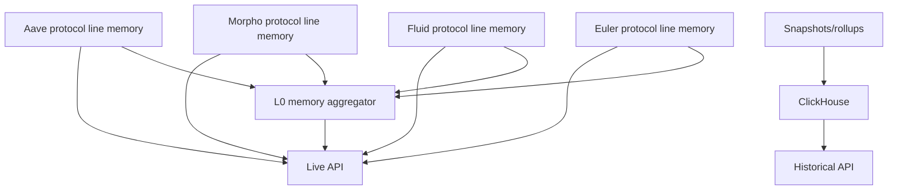

# Serving And API Architecture

Live serving is memory-first. ClickHouse is the durable historical and analytics
store.

## Serving Rule

```text
current account risk:
  protocol-line memory vectors

current market/protocol risk:
  protocol-line L1 vectors and indexes

current cross-protocol risk:
  L0 memory vector

history and analytics:
  ClickHouse rollups, snapshots, facts, witnesses

debug and compatibility:
  current raw rows and latest-state views
```

## Serving Topology



The API can be a separate process, but it should read current state through
memory publication channels rather than recomputing live risk from ClickHouse.

## Publication Model

Each protocol line publishes immutable epochs:

```text
ProtocolMemoryEpoch {
  protocol_id
  deployment_id
  chain_id
  block_number
  block_hash
  block_timestamp
  vector_epoch_id
  account_risk_vector_ref
  account_vector_ref
  asset_vector_ref
  market_vector_ref
  serving_indexes_ref
  protocol_vector
  protocol_vector_hash
}
```

Publication should be atomic:

```text
build next epoch
finish recompute and indexes
swap read pointer
serve new epoch
keep previous epoch briefly for in-flight requests
```

## API Read Paths

Account request:

```text
protocol_id + account_address
  -> protocol line
  -> account_index from slot registry
  -> account_vector
  -> account_risk_vector
  -> optional position detail from position vector
```

Market request:

```text
protocol_id + market_id
  -> market_slot
  -> market_vector
  -> exposure index
  -> risk summaries and top accounts
```

Reserve/asset request:

```text
protocol_id + asset_address
  -> asset_slot
  -> asset_reserve_vector
  -> asset exposure index
  -> account risk summaries
```

Protocol overview:

```text
protocol_id
  -> L1 protocol vector
  -> health buckets, totals, top risks, exposure summaries
```

Cross-protocol dashboard:

```text
L0 cross_protocol_vector
  -> protocol comparison
  -> global totals
  -> correlated asset exposures
  -> top global risky accounts
```

History:

```text
query ClickHouse rollups/snapshots
```

## Serving Indexes

Maintain memory indexes for current views:

```text
by_health_factor
by_ltv
by_debt_usd
by_collateral_usd
by_liquidation_distance
by_asset_exposure
by_market_exposure
by_updated_block
```

Update strategies:

```text
incremental:
  update only accounts affected by recompute

windowed rebuild:
  rebuild an index after each checkpoint window

full rebuild:
  rebuild after recovery, hash mismatch, or broad invalidation
```

Risk-only indexes can be rebuilt from risk vectors. Exposure indexes need
position vectors or precomputed exposure summaries.

## Memory API Boundary

The API should not mutate protocol vectors. It should receive read-only views:

```text
VectorReadView
ProtocolVectorView
CrossProtocolVectorView
ServingIndexView
```

If an API endpoint needs data that is not in memory, it should either:

```text
read historical data from ClickHouse
or request a new serving index/summary be added to the protocol publication
```

It should not ad hoc recompute live risk from raw rows.

## L0 Serving Contract

L0 publishes:

```text
CrossProtocolMemoryEpoch {
  chain_id
  alignment_mode
  source_protocol_epochs
  cross_protocol_vector
  asset_exposure_summaries
  protocol_statuses
  stale_protocols
  cross_protocol_vector_hash
}
```

L0 statuses:

```text
fresh
stale
recovering
degraded
disabled
```

A stale protocol remains visible with its last valid epoch and staleness metadata.

## ClickHouse API Use

Use ClickHouse for:

```text
time series
rollups
audit trails
snapshot browsing
historical risk windows
debug views
validation reports
recovery inspection
```

Do not use ClickHouse for:

```text
live per-block risk recomputation
live current sorting over all accounts
per-request derivation of current account health from raw facts
L0 live aggregation when memory L1 vectors are available
```

## Compatibility Mode

During migration, endpoints may read:

```text
account_risk_current
protocol_risk_current
reserve_exposure_current
```

Compatibility mode must be marked as such and should have parity checks:

```text
memory risk vs current table risk
memory aggregate vs rollup/current aggregate
memory sample vs direct RPC witness
```

The target is memory-first for live endpoints.

## API Consistency

Every live response should include:

```text
protocol_id
deployment_id
chain_id
block_number
block_hash
block_timestamp
vector_epoch_id
data_freshness_status
producer_version
```

Cross-protocol responses include all source protocol epochs.

## Fallback Behavior

If a protocol line is unavailable:

```text
serve last valid L1 vector if available
mark protocol stale
route history requests to ClickHouse
do not fabricate current risk
```

If L0 is unavailable:

```text
serve protocol-specific current endpoints if protocol lines are healthy
mark cross-protocol endpoints degraded
reload L0 from latest L1 vectors when restarted
```

If ClickHouse is unavailable:

```text
live memory endpoints can continue for current data
history/debug/recovery endpoints degrade
protocol-line watermark commit may pause if durable writes cannot complete
```

## Acceptance Criteria

Serving is acceptable when:

```text
live current risk reads memory first
API responses include vector epoch metadata
L0 serves cross-protocol state from L1 vectors
stale protocols are visible but isolated
historical endpoints use ClickHouse rollups/snapshots
compatibility current rows are not required for live serving
serving indexes can be rebuilt from vectors
```
